# **다같이 참새를 때려잡자** 〈Let's All Beat the Sparrows Together〉

## **version: 1.0.7**
made with `pygame`, made by `whitedove428`

## setup
파이썬을 설치한다. 3.7에서 정상 작동하고, 대부분의 버전에서 잘 작동할 것이다. [여기](https://www.python.org/downloads/)에서 설치하는 윈도우 사용자들은 반드시 설치 중 '환경변수(Path) 추가'를 선택해야 한다.

필수 패키지를 설치한다.

```
$ pip install pygame
$ pip install numpy
```

파이썬을 설치할 때 같이 설치되는 pip(패키지 관리 도구)이 구버전이면 오류 메시지가 출력될 수 있다.
그럴 때는 차분히 메시지대로

```
$ pip install --upgrade pip
```

을 통해 최신 버전으로 업그레이드한다.

## download
```
$ cd my_path
$ git clone https://github.com/gkm42917/Lets-All-Beat-the-Sparrows-Together.git
```

또는 직접 다운로드해서 적당한 곳에 위치시킨다.

## run
```
$ cd my_path/Lets-All-Beat-the-Sparrows-Together
$ python game.pyw
```

또는 다른 방법으로 실행하여도 좋다.

## initiate scoreboard
```
$ cd my_path/Lets-All-Beat-the-Sparrows-Together
$ python initiate_scoreboard.py
```

초기화된 점수판은 복구할 수 없다.

점수판은 게임 내에서 확인할 수 있다.

## 해로운 새를 때려죽이자
* 플레이타임: 10분 내외

* 메뉴에서 60 프레임, 게임 스테이지에서 24프레임

* 메뉴에서는 주로 방향키와 엔터 키로 조작

* F11: 전체화면 On/Off

* ESC: 옵션 (게임 스테이지에서만)

* 게임 스테이지에서의 조작법: Menu → Option → Controls에 대략 첨부

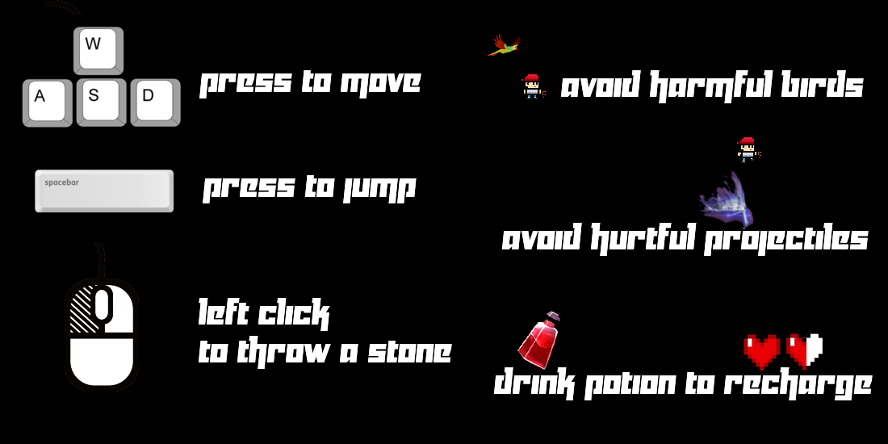

# 게임 플레이

## 새총
* 공중에 체공할 수 있는 돌은 최대 `6`개(렉을 줄이기 위해 제한)
* `Shoot!`: 발사 가능
* `Wait!`: 돌이 바닥에 떨어질 때까지 발사 불가능
* 최대 대미지는 120가량

## 패배 조건
1. `생명력`이 0이 됐을 때
2. `밀밭 내구도`가 0이 됐을 때

## 음식 목록
| 음식 | 비고 |
|:---:|:---:|
| 포션 | 1.5hearts 회복 |
| 포션(뚱캔) | 3.0hearts 회복 |
| 관통 캔 | 스파이어 철거 시 드랍 |
| 샷건 캔 | 인면조 처치 시 드랍 |
| 빠른 장전 캔 | 추가 목표 달성 시 드랍 |

## 해로운 새 목록
| 해로운 새 | 유형 | 체력 | 비고 |
|:---:|:---:|---:|:---:|
| 참새 | 일반 | 1 |  |
| 타조 | 일반 | 1 |  |
| 정예타조 | 정예 | 200 |  |
| 뮤탈리스크 | 정예 | 300 |  |
| UFO | 일반 | 1 |  |
| 인면조 | 우두머리 | 2880 |  |
| 무리군주 | 정예 | 1500 | 공생충을 소환 |
| 공생충 | 일반 | 1 |  |
| 메디브 | 우두머리 | 5760 |
| 비둘기 | 번외 | 1 |  |
| 까마귀 | 번외 | 1 |  |
| 두루미 | 번외 | 1 |  |
| 펠리컨 | 번외 | 1 |  |
| 앵무새 | 번외 | 1 |  |

## 구조물 목록
| 구조물 | 체력 | 비고 |
|:---:|---:|:---:|
| 스파이어 | 6000 | 뮤탈리스크를 소환 |
| 그레이터 스파이어 | 12000 | 뮤탈리스크, 무리군주를 소환 |

## 투사체 목록
| 투사체 | 대미지 | 비고 |
|:---:|---:|:---:|
| 돌 | 0~120 | 플레이어가 발사 |
| 쐐기벌레 | 0.5hearts | 뮤탈리스크가 발사 |
| 레이저빔 | 1.0hearts | UFO가 발사 |
| 새똥 | 1.0hearts | 참새가 배변 |
| 비전균열 | 1.0hearts | 메디브가 발사 |

## 아직 수정되지 않은 버그

\-

# 스크린샷

## 게임플레이 영상
[유튜브에서 보기](https://www.youtube.com/watch?v=CkQKDU5AZGs&feature=youtu.be)

## Title


## Menu
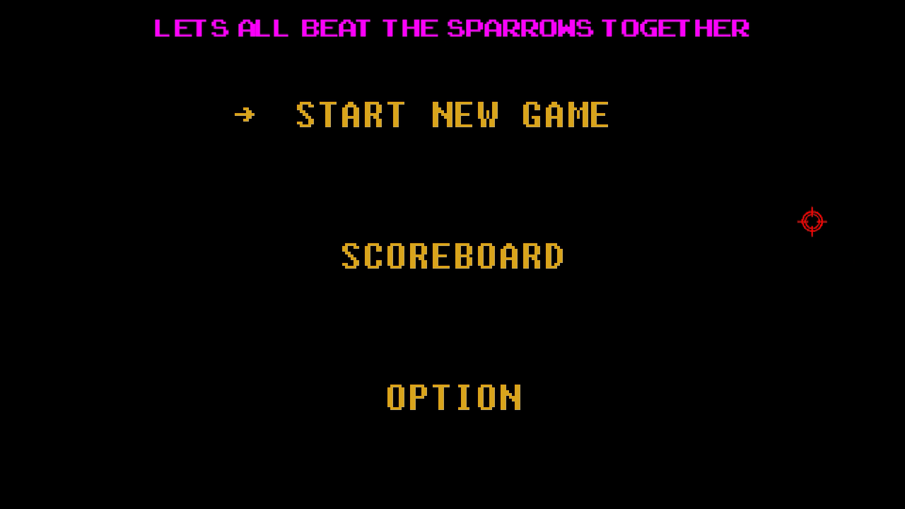

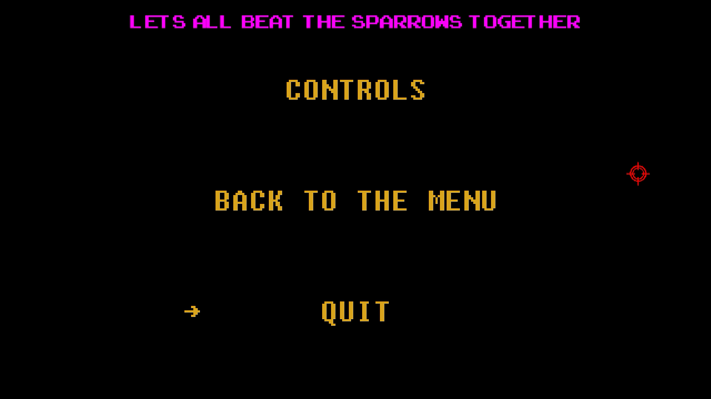

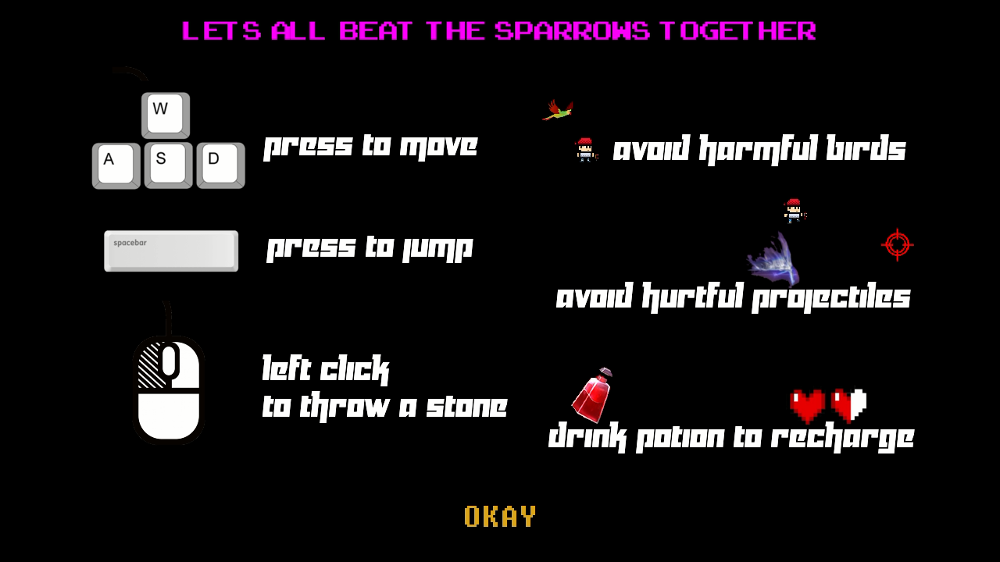

## befor Game
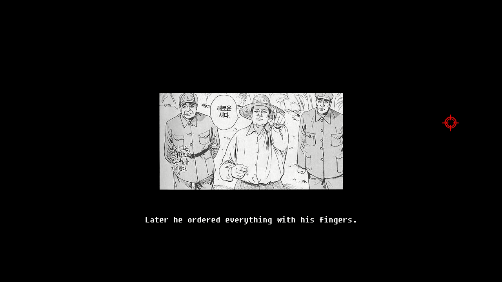


## in Game
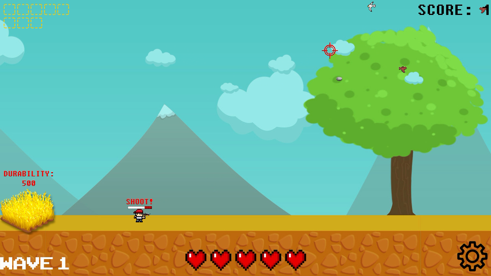

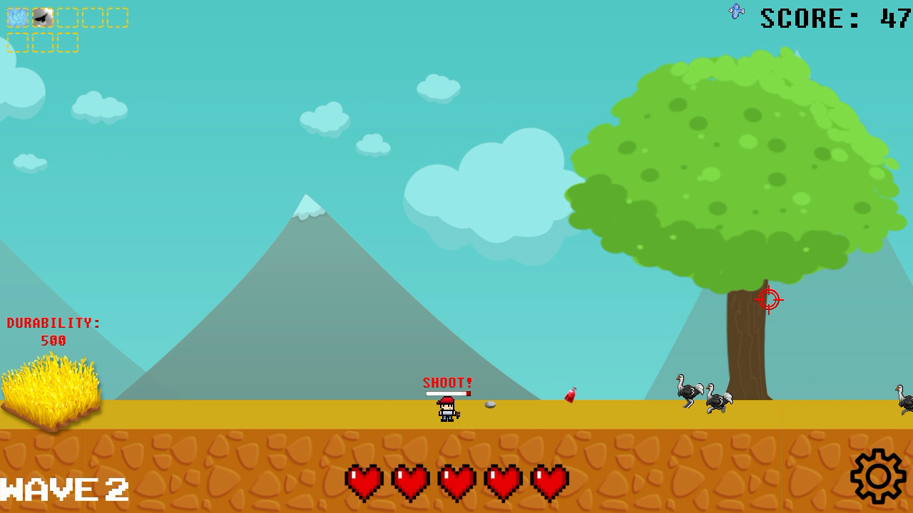

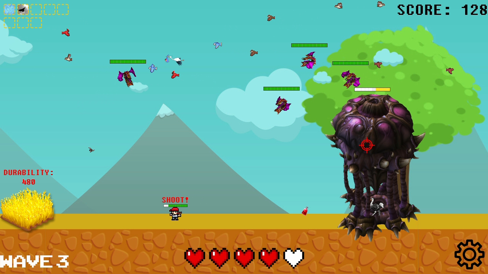

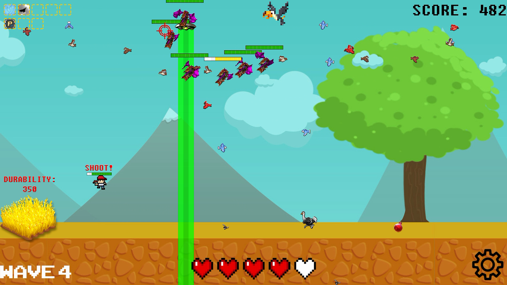

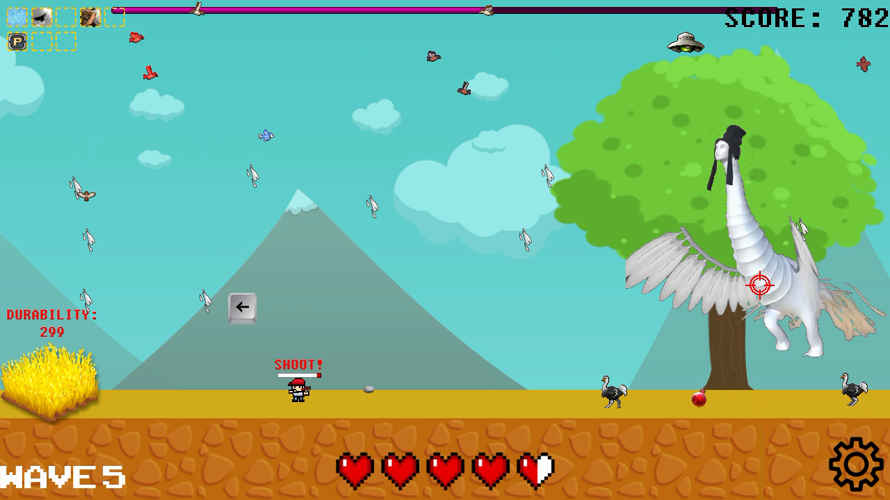

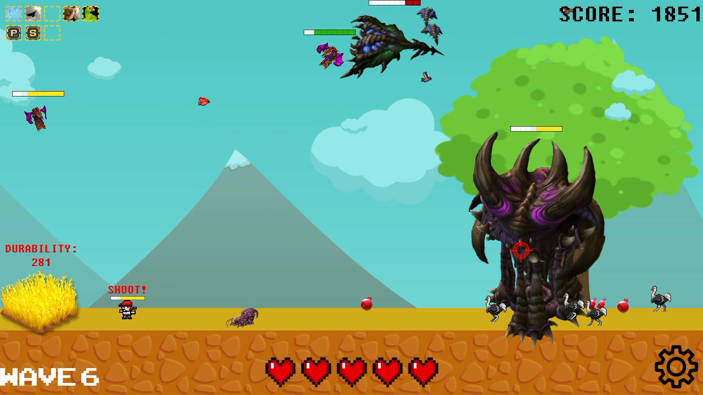

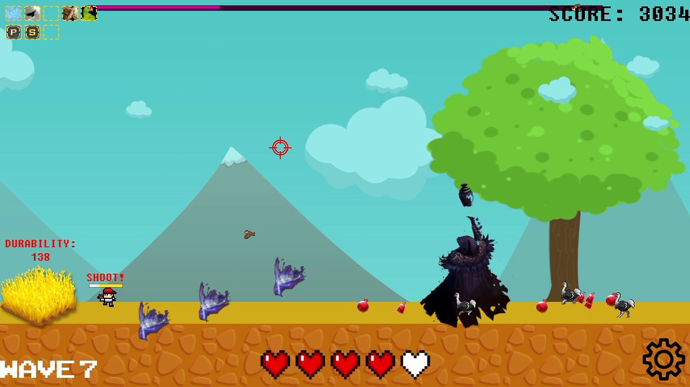

## after Game
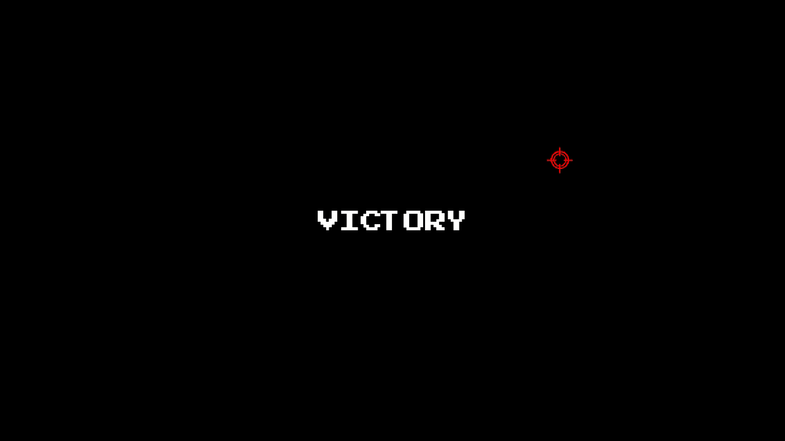

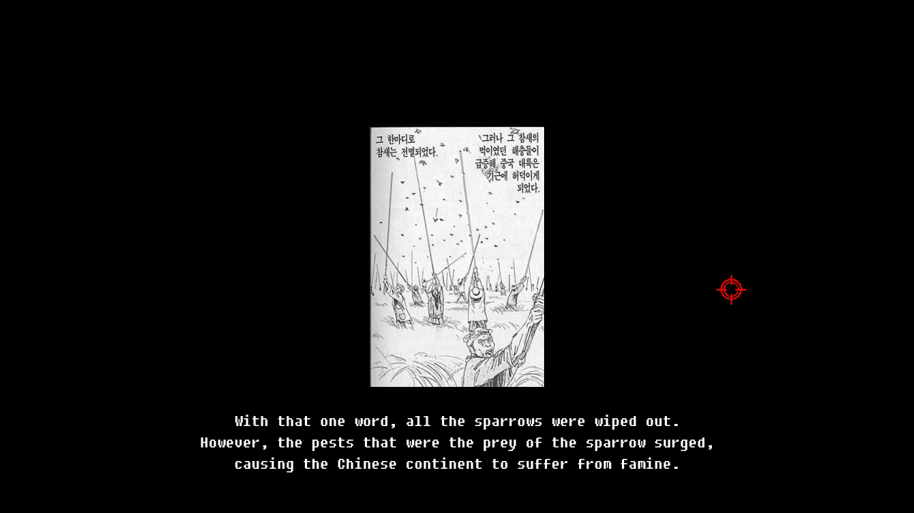

## Statistics & Board
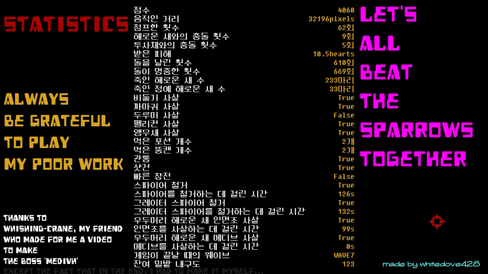

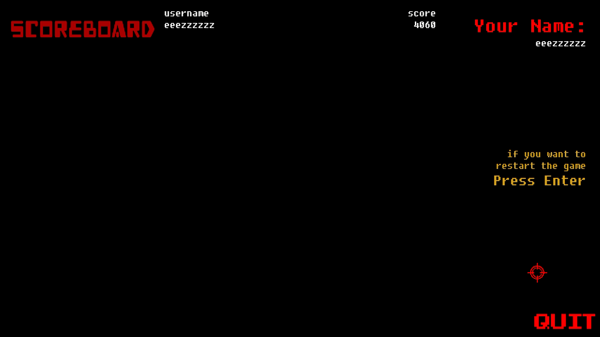

# 여담

## 문제점
1. 첫째로 미숙한 상태에서 만든 스파게티 코드. 돌과 충돌하면 삭제되는 일반 새를 만들고 생명력이 있는 정예 새를 만들었는데, 일반 새도 애초에 생명력이 1인 정예 새로 만들었으면 상당히 코드가 간결해졌을 것이다. 

1. C/C++에서는 잘만 되던 Backspace '\b'가 작동하지 않는다. 이것 탓에 점수판 만드는 데 상당히 고생했다. 아마 내가 모르는 다른 방법이 있지 싶다.

1. 플레이어는 클래스를 배우기 전에 만들어서 객체가 아니다. 객체로 만들었으면 2player도 쉽게 만들 수 있을 텐데 조금 아쉬운 점이다. 그러나 객체가 아니었던 돌을 객체로 뜯어고치면서 고생을 실컷 했었고 당장 불필요하게 플레이어까지 수정하면서 고생할 생각은 없다.

1. 게임 스테이지에서만 24프레임이다. 이게 말할 거리가 많은 게, 'pygame.image.load()'마다 뒤에 .convert()나 convert_alpha()를 붙이지 않으면 매 틱마다 이미지를 로드한다고 한다. 한창 작업하는 도중 알게 되었다. 실제로 측정해보니 60프레임으로 설정해놓은 것이 24프레임으로 작동하고 있었다. 그래서 전부 수정한 다음 게임 스테이지에서만 24프레임으로 작동하게 바꿨다. (convert()와 convert_alpha()의 차이는 후자가 투명색을 지원한다는 것.) 참새 같은 경우는 속력이 3~4 정도인데 이걸 60프레임으로 했으면 정수만 지원하는 pygame에서 어떻게 만들었을까 하는 생각도 든다. 새옹지마라고 할 만하다.

1. 그 많은 텍스트들을 만들 때 배경을 투명하게 할 경우 하나당 7줄 정도를 차지한다. 처음부터 함수를 만들어서 텍스트를 생성할 걸 하는 생각이 든다.

1. 많은 사진을 여러 게임 또는 유명한 밈에서 가져왔다. 메탈슬러그에서 관통, 샷건, 퀵차지의 아이콘과 UFO를, 스타크래프트에서 스파이어, 그레이터 스파이어, 뮤탈리스크, 무리군주를, 히어로즈 오브 더 스톰에서 포션과 메디브를, 평창 동계 올림픽에 등장하여 특유의 기괴함으로 유명했던 인면조를 사용했다.

1. 보스 인면조에서 패턴을 만든다고 "춤을 추지 않으면 잡아먹을 테야!"라는 대사를 달아놓고 플레이어가 왼쪽 오른쪽으로 움직이지 않으면 참새가 똥을 싸게 만들었다. 결과물은 심히 조잡하기가 이를 데가 없다.

1. 최종 보스 메디브의 생김새를 자세히 보면 구멍이 숭숭 뚫려있다. 전부 다른 게임에서 캡처해 포토샵으로 수정한 것이기 때문이다. 구멍 뚫린 부분은 체력바와 닉네임이 있던 자리다.

1. 포토샵이 png 파일에 표준이 아닌 데이터를 써놓는다고 한다. 실행이 안 되진 않지만 거슬리게 오류 메시지를 띄웠었는데, 구글링으로 없애는 방법을 알아냈다. [ImageMagick](https://imagemagick.org/index.php)을 깐다. 윈도우에서 설치를 하는 경우 'Install legacy utilities (e.g. convert)'를 체크한다. 이걸 해야지 명령 프롬프트에서 일괄 변환을 할 수 있다. 그리고 배치 파일을 만든다. 실행하면 같은 폴더에 있는 모든 png 파일이 변환된다.

```python
# pygame 텍스트 투명 배경 설정
text = arcadeFont35.render('대충 텍스트', True, (255, 255, 255))
textRect = text.get_rect()
textRect.centerx = windowSurface.get_rect().centerx
textRect.centery = windowSurface.get_rect().centery+320
alpha_img = pygame.Surface(text.get_size(), pygame.SRCALPHA)
alpha_img.fill((255, 255, 255, 255))
text.blit(alpha_img, (0, 0), special_flags=pygame.BLEND_RGBA_MULT)
```

```bat
:: ImageMagick의 convert [입력] -strip [출력]
@echo off
echo All files in format png will be converted.
for %%i in (*.png) do (
convert %%i -strip %%i
echo %%i converted
)
pause
```

## 참새의 무작위적 움직임
만들기 위해 고민을 많이 했던 대목이다. 결국 구현한 방법은 다음과 같다. 허공의 x, y 좌표 tuple을 촘촘하게 모아 배열에 넣은 뒤 저장한다. 그것들이 ./array에 있는 네 개의 파일이다. 처음 생성될 때 그 중 하나를 목표지점으로 잡고 그쪽으로 이동한다. 도달하면 다시 다른 목표지점을 잡아 이동한다. 계속 반복한다.

## 뮤탈리스크의 이동 경로
매개변수 θ를 사용하여 나타낼 수 있다.

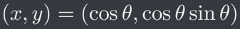

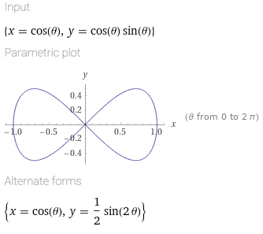
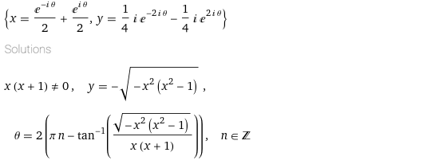
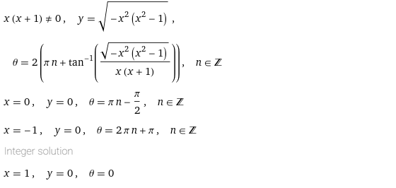

그래프의 모양을 가다듬기 위해서 아래 식을 곱한다.(scaling)

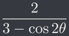

아래와 같이 표현된다.

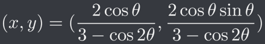

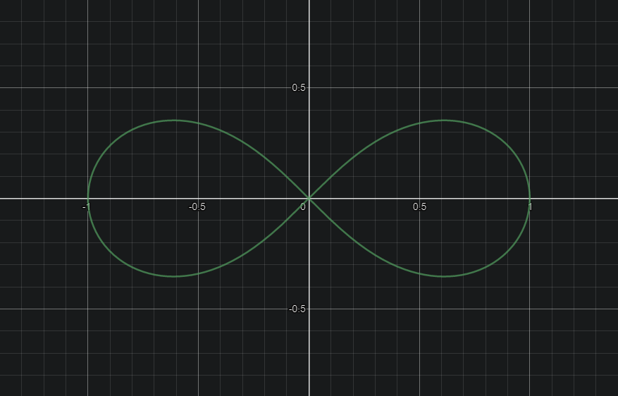

θ 값에 따른 점의 위치

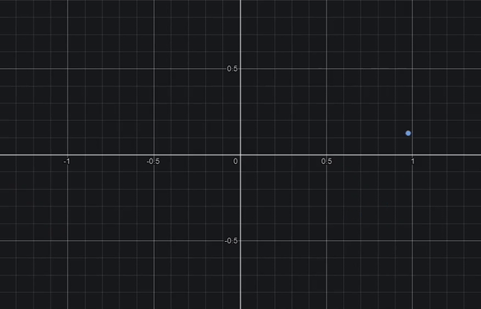

이를 활용하여 뮤탈리스크의 이동 경로를 만들 수 있다.

## 메디브의 패턴
허공을 맴돌다 착지해 비전균열을 발사한다. 플레이어가 피격당하면 다시 발사한다. 피했다면 다시 까마귀로 변신한다. 첨하자면 원작(HOS) 고증이다.

## 통계를 만든 이유
누군가 이걸로 `강화학습`을 해보면 좋을 것 같다고 말했다. 그런데 이런 통계가 명확해야 한다고 말해서 고생 끝에 30개를 만들었다. 그런데 지금 기능으로는 게임이 종료되기 전까지 반환하는 기능이 없어서 수정해야 할지도 모르겠다. 그리고 별로 하고 싶지 않다.

## 효과음이 없는 이유
원래 넣으려고 했지만 작업량이 너무 많아서 생략했다. 1.0.8에는 효과음이 들어갈지도.

# License
다같이 참새를 때려잡자는 GNU General Public License v3.0 아래 배포됩니다. 세부사항은 [LICENSE](./LICENSE) 파일에서 확인하십시오.